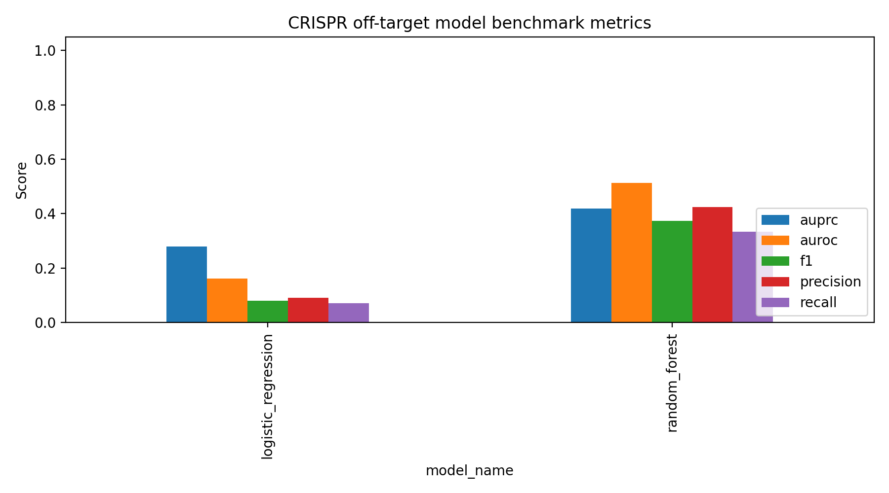
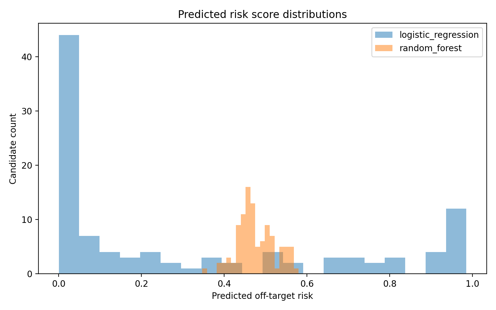

# CRISPR-EditSafe-ML Benchmark Report

## Overview
This report summarizes baseline model performance for a standardized CRISPR off-target dataset.

## Benchmark summary

|   n |   positive_rate |   threshold |   accuracy |   precision |    recall |       f1 |    auprc |    auroc | confusion_matrix     | model_name          | split_strategy   |   n_features |   n_train |   n_test |
|----:|----------------:|------------:|-----------:|------------:|----------:|---------:|---------:|---------:|:---------------------|:--------------------|:-----------------|-------------:|----------:|---------:|
| 103 |        0.407767 |         0.5 |   0.330097 |   0.0909091 | 0.0714286 | 0.08     | 0.279506 | 0.161202 | [[31, 30], [39, 3]]  | logistic_regression | sgRNA_disjoint   |          188 |       554 |      103 |
| 103 |        0.407767 |         0.5 |   0.543689 |   0.424242  | 0.333333  | 0.373333 | 0.41953  | 0.513076 | [[42, 19], [28, 14]] | random_forest       | sgRNA_disjoint   |          188 |       554 |      103 |

## Best model by AUPRC

- Model: `random_forest`
- AUPRC: `0.4195295135233322`
- AUROC: `0.5130757220921155`
- F1: `0.3733333333333333`

## Metric comparison

## Risk-score distributions

## Interpretation notes

- AUPRC is emphasized because CRISPR off-target data are often class-imbalanced.
- sgRNA-disjoint evaluation is preferred when enough unique guides are available.
- Small demo datasets can produce unstable or perfect-looking scores; use public benchmark datasets for meaningful interpretation.

## Reproducibility

Benchmark directory: `results\tsai_guideseq_2015_benchmark`
